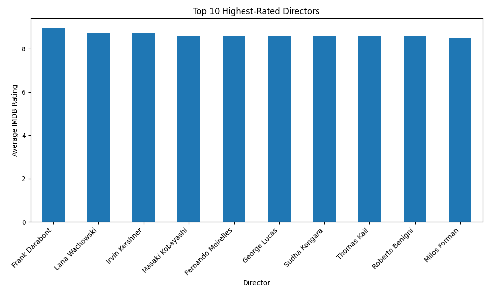
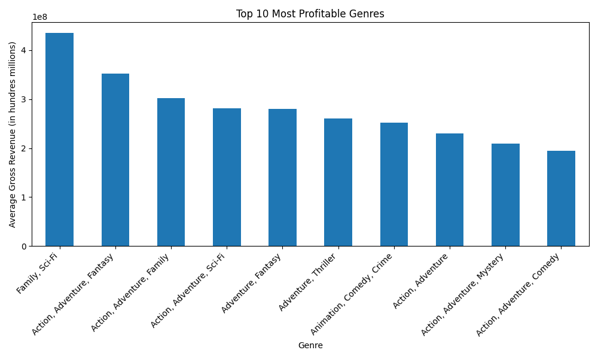
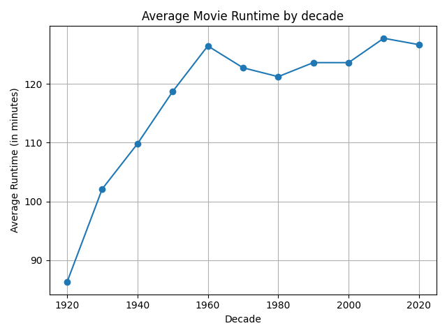
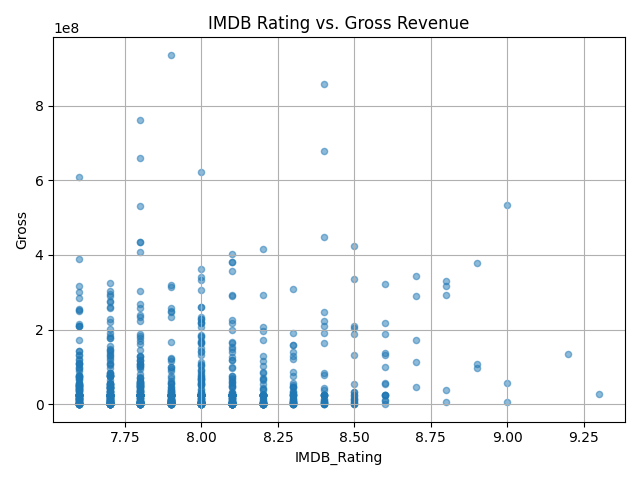

# Exploratory Data Analysis of IMDb's Top 1000 Movies

## Project Overview

This project performs a full Exploratory Data Analysis (EDA) on the IMDb Top 1000 Movies dataset sourced from Kaggle. The primary goal is to practice fundamental data science skills, including data cleaning, transformation, analysis, and visualization using the Python Pandas and Matplotlib libraries.

The workflow follows a standard ETL (Extract, Transform, Load) process to prepare the raw data for analysis, from which key insights about movie ratings, genres, and revenue are derived.

---

## Data Source

*   **Dataset:** IMDb Top 1000 Movies
*   **Source:** [Kaggle](https://www.kaggle.com/datasets/harshitshankhdhar/imdb-dataset-of-top-1000-movies-and-tv-shows)

---

## ETL Process: Data Cleaning and Preparation

The raw dataset contained several issues that were addressed during the transformation phase:

*   **Dropped Unnecessary Columns:** Removed columns not relevant to the analysis, such as `Poster_Link`, `Overview`, and `Certificate`, to simplify the dataset.
*   **Handled Missing Values:**
    *   **Gross Revenue:** 169 missing values were filled with the median gross revenue of the entire dataset.
    *   **Metascore:** 157 missing values were filled with the mean Metascore.
*   **Corrected Data Types:**
    *   **Runtime:** Converted from an object (e.g., "142 min") to an integer (142).
    *   **Gross Revenue:** Converted from an object with commas (e.g., "1,234,567") to an integer.
    *   **Released_Year:** Ensured the column was a numeric type for calculations.
*   **Feature Engineering:**
    *   Created a `Decade` column from the `Released_Year` to facilitate trend analysis over time.

The final, cleaned dataset was saved to `cleaned_imdb_data.csv`.

---

## Key Findings & Visualizations

### 1. Who are the highest-rated directors?

The analysis reveals that directors like Frank Darabont and Lana Wachowski have the highest average IMDb ratings, with the top contenders all having ratings clustered closely together.

### 2. Which movie genres are the most profitable?

By calculating the average gross revenue per genre, it's clear that some genres are significantly more profitable than others. Blockbuster genre combinations, especially those blending Family, Sci-Fi, and Adventure, consistently generate the highest average gross revenue.

### 3. Have movies gotten longer over time?

The analysis of average runtime per decade shows a clear trend: average movie runtimes increased dramatically from the 1920s to the 1960s and have remained consistently longer in the modern era.

### 4. Is there a correlation between IMDB rating and revenue?

The scatter plot visualizes the relationship between a movie's rating and its gross revenue. There is a visible positive correlation, suggesting that higher-rated movies tend to earn more gross revenue, although there is significant variance and many exceptions.

---

## Tools and Libraries Used

*   **Python 3**
*   **Pandas:** For data manipulation and ETL.
*   **Matplotlib:** For data visualization.
*   **Jupyter Notebook** 
